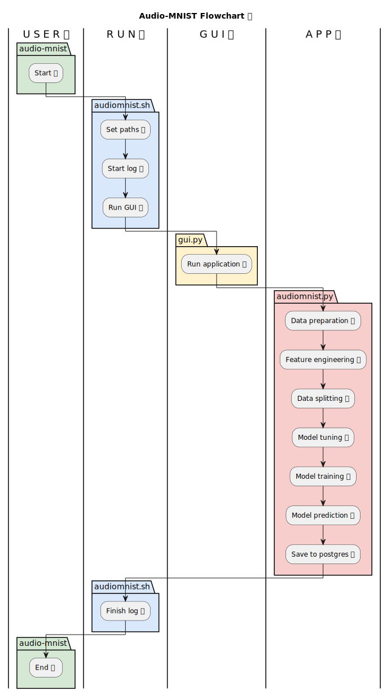

# Gender Recognition By Voice Analysis 🗣️🎙️
This project leverages acoustic features from voice recordings to predict the speaker's gender. Utilizing a large dataset and the XGBoost machine learning library, this project aims to build a high-accuracy model for gender classification based on voice characteristics.


### Table of Contents 📖
- [Project Overview](#project-overview) 🔍
- [Structure](#structure) 📂
- [Data Summary](#data-summary) 🎲
- [Dataset](#dataset) 📊
- [Model Selection](#model-selection) 🧰
- [Model Architecture](#model-architecture) ⚙️
- [Model Features](#model-features) 🧬
- [Model Performance](#model-performance) 🎯
- [PostgreSQL Integration](#postgresql-integration) 🛢️
- [Conclusion](#conclusion) 💡
- [Requirements](#requirements) 📑
- [Execution](#execution) 🏃‍♂️
- [Flowchart](#flowchart) 🔁
- [Unit Tests](#unit-tests) 🧪
- [Developer](#developer) 👤

### Project Overview
Voice recordings provide insights into various speaker attributes, including content, emotional state, gender, and identity. This project focuses on gender recognition, aiming to develop a model that accurately identifies gender-specific patterns in voice recordings through acoustic features.

### Structure
```
┌── audio                       <-- Audio Folder
|   └── recordings              <-- Recordings Folder
|       └── *.wav               <-- Audio Recordings
|   └── audioMNIST_meta.txt     <-- Meta Information
|
├── config                      <-- Configuration Folder
|   └── *.yaml                  <-- Configuration Files
|
├── data                        <-- Data Folder
|   └── *.csv                   <-- Data Files
|
├── html                        <-- HTML Folder
|   └── *.html                  <-- HTML Files
|
├── images                      <-- Image Folder
|   └── *.png                   <-- Image Files
|
├── logs                        <-- Log Folder
|   └── *.log                   <-- Log Files
|
├── parameters                  <-- Parameters Folder
|   └── *.yaml                  <-- Model Parameters
|
├── plots                       <-- Plots Folder
|   └── *.png                   <-- Plots
|
├── results                     <-- Results Folder
|   └── *.yaml                  <-- Model Results
|
├── src                         <-- Source Folder
|   └── *.py                    <-- Source Files
|
├── test                        <-- Test Folder
|   └── *.py                    <-- Unit Tests
|
├── text                        <-- Text Folder
|   └── *.txt                   <-- Text Files
|
├── .gitignore                  <-- Git Ignore Configuration
|
├── .pre-commit-config.yaml     <-- Pre-Commit Configuration
|
├── audio_mnist.py              <-- Main Python Script
|
├── audio_mnist.sh              <-- Main Shell Script
|
├── flowchart.wsd               <-- Pipeline Flowchart
|
├── gui.py                      <-- GUI Python Script
|
├── readme.md                   <-- You Are Here
|
└── requirements.txt            <-- Package Requirements
```

### Dataset
This project utilizes a comprehensive [dataset](https://www.kaggle.com/datasets/primaryobjects/voicegender) with 30,000 spoken digits (0-9) audio samples from 60 distinct speakers. Each speaker's directory contains their audio recordings and a meta-information file.

### Data Summary
Explore a detailed data profiling report by opening the `html/profiling_report.html` file in your web browser. This report offers statistical insights, distribution plots, and a comprehensive overview of the dataset's characteristics.

### Model Selection
The choice of [XGBoost](https://xgboost.readthedocs.io/en/stable/) (eXtreme Gradient Boosting) is based on its efficiency and scalability, especially for large datasets and complex models. It effectively handles missing values, categorical variables, and high-dimensional data, making it well-suited for this project. XGBoost's regularization techniques help prevent overfitting and enhance model generalization.

### Model Architecture
A gradient boosting tree ensemble model within the XGBoost framework is employed. This model synergizes predictions from multiple decision trees to determine the speaker's gender. Fine-tuning is achieved through key parameters, allowing for optimal performance.

The model uses the following key parameters:
| Parameter       | Description          |
|-----------------|----------------------|
| `learning_rate` | Learning Rate        |
| `max_depth`     | Max Depth Of Tree    |
| `n_estimators`  | Number Of Estimators |
| `objective`     | Objective Function   |
| `tree_method`   | Tree Method          |

### Model Features
The model uses various statistical features from both time-domain and frequency-domain data of the audio samples. These features are crucial for training the model to recognize gender-specific patterns.

These features include:
| Feature     | Description        |
|-------------|--------------------|
| `mean`      | Mean               |
| `std`       | Standard Deviation |
| `med`       | Median             |
| `min`       | Minimum            |
| `q25`       | 25th Percentiles   |
| `q75`       | 75th Percentiles   |
| `max`       | Maximum            |
| `skew`      | Skewness           |
| `kurt`      | Kurtosis           |
| `zeroxrate` | Zero Crossing Rate |
| `entropy`   | Entropy            |
| `sfm`       | Spectral Flatness  |
| `cent`      | Frequency Centroid |

### Model Performance
The model has achieved a promising accuracy rate of `97.83%` on the test dataset, showcasing its potential in gender recognition through voice analysis.

### PostgreSQL Integration
PostgreSQL integration enhances data management capabilities. By utilizing [PostgreSQL](https://www.postgresql.org), an open-source object-relational database system, we ensure scalability, robustness, and efficient data storage and retrieval. Store connection details in the `config/postgres.yaml` file and perform database operations using SQL queries.

### Conclusion
This project exemplifies the application of machine learning in voice and speech analysis, showcasing the potential to discern gender through acoustic features.

### Requirements
Execute `pip install -r requirements.txt` to install the required libraries.

### Execution
Execute `audiomnist.sh` to initiate the entire pipeline.

Following arguments can be specified:
| Argument              | Description                               |
|-----------------------|-------------------------------------------|
| `-c`, `--cfg_file`    | Path to the configuration file            |
| `-y`, `--pgs_file`    | Path to the PostgreSQL configuration file |
| `-d`, `--data_prep`   | Execute the data preparation step         |
| `-f`, `--feat_eng`    | Execute the feature engineering step      |
| `-s`, `--data_split`  | Execute the data splitting step           |
| `-u`, `--model_tune`  | Execute the model tuning step             |
| `-t`, `--model_train` | Execute the model training step           |
| `-p`, `--model_pred`  | Execute the model prediction step         |
| `-q`, `--save_sql`    | Execute the save to postgreSQL step       |

### Flowchart


### Unit Tests
Execute `python -m unittest discover test` to run all unit tests, ensuring the reliability of the code base.

### Developer
Execute `python -m pre_commit run --all-files` to ensure code quality and formatting checks.
